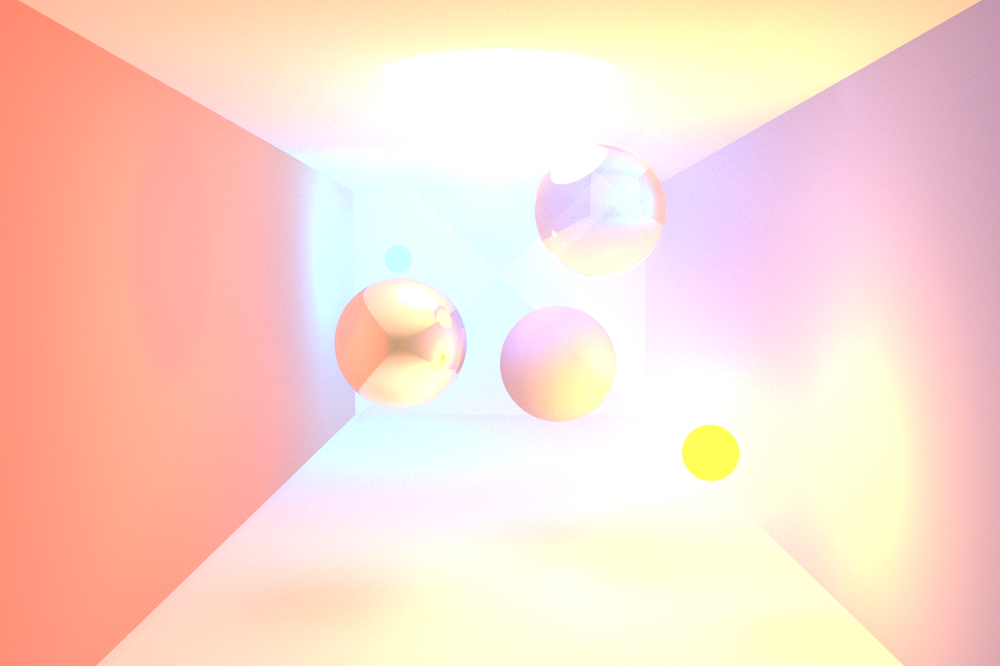

# Overview
This project is based on *smallpt* by Kevin Beason (https://www.kevinbeason.com/smallpt/). It was extended to include features such as volumetric lights, explicit light source sampling and vignetting.

# Compilation

The code can be compiled using the following command
```
g++ -O3 cgrpt2.cpp -o cgrpt -lopengl32 -lgdi32
```

# Execution
A rendering can be generated by executing the compiled script.
There are a number of arguments available
```
spp: samples per pixel
res: resolution
scene: 0, 1, 2 or 3 (defaults to 0)
els: explicit light source sampling -> either 0 or 1
ka: absorption parameter
ks: scattering parameter
g: henyey greenstein phase function parameters -> -1 <= g <= 1

usage: cgrpt.exe -spp -res -scene -els -ka -ks -g
```

# Showcase

## Scene 1
|  | 
|:--:| 
| *cgrpt.exe 10000 800 0 1* |

|  | 
|:--:| 
| *cgrpt.exe 10000 800 0 1 0.004 0.02 0.85* |

## Scene 2
|  | 
|:--:| 
| *cgrpt.exe 10000 800 1 1* |


|  | 
|:--:| 
| *cgrpt.exe 10000 800 1 1 0.01 0.05 0.9* |

# Additional Resources

- **David Pysp**. [Bidirectional path tracing for rendering participating media](https://github.com/davidpypysp/softbivpt).
- **Matt Pharr**. [Light transport ii: Volume rendering](https://pbr-book.org/3ed-2018/Light_Transport_II_Volume_Rendering).
- **Kevin Beason**. [smallpt: Global Illumination in 99 lines of C++](https://www.kevinbeason.com/smallpt/).

